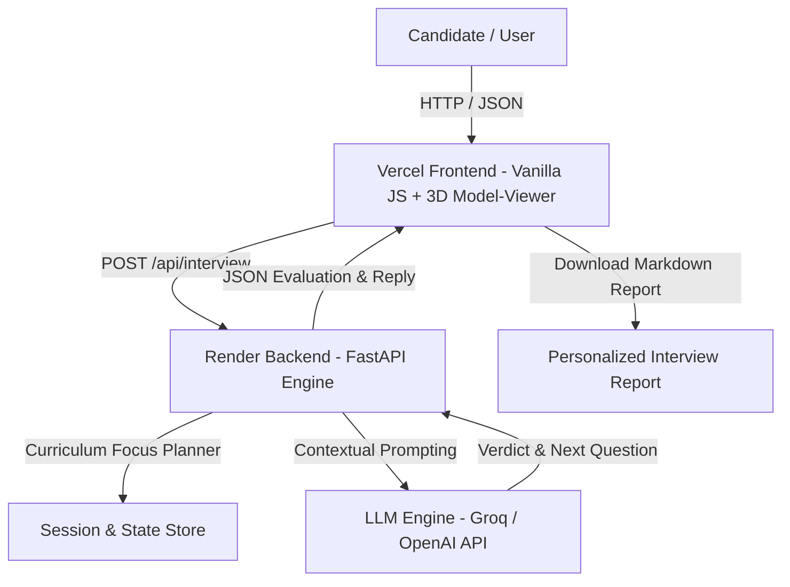

# interviewIQ — Enterprise AI Technical Interview Simulator 🚀

[](https://fastapi.tiangolo.com)
[](https://www.python.org/)
[](https://groq.com)
[](https://vercel.com)
[](https://render.com)

**interviewIQ** is a realistic, multi-turn AI Technical Interview Agent built for candidates completing an intensive enterprise AI engineering cohort. It assesses candidate mastery across core AI & software engineering topics, adapts dynamically based on response quality, and generates structured performance reports.

---

## 🌐 Live Production Link

> [!NOTE]
> **For Evaluators & Judges**: The Vercel Frontend and Render Backend are **fully interconnected**. You only need to open the **Vercel Live Demo link** below to test the full application—all API calls, 3D graphics, and LLM evaluations will automatically route to the active Render backend in real time!

* 🚀 **Vercel Live Demo (Judges Click Here)**: [https://interview-agent-vicodathon.vercel.app](https://interview-agent-vicodathon.vercel.app)
* ⚙️ **Render Backend API (Auto-Connected)**: [https://interviewiq-api.onrender.com](https://interviewiq-api.onrender.com)

---

## 🏗️ System Architecture



---

## ✨ Key Features

* **Multi-Turn Adaptive Interviews**: Evaluates candidates over a minimum of 8 questions across at least 4 curriculum modules (RAG, Vector Databases, Prompt Engineering, Agentic AI, MCP, Deployment).
* **Interviewer Personas**: Selectable interviewer styles:
  * 🏗️ **Pragmatic Architect**: Focuses on trade-offs, system constraints, and production edge cases.
  * 🧠 **Socratic Mentor**: Guides with probing follow-ups and conceptual clarity.
  * 🎯 **Rigorous Engineering Lead**: Direct, strict syntax and design pattern evaluation.
* **Dynamic Non-Repetitive Responses**: Advanced fallback heuristics ensure every turn generates unique, topic-grounded questions—even when candidates answer *"idk"*, *"no idea"*, or pass.
* **Overall Progress Analytics**: Tracks completed sessions, verdict ratios (Strong vs. Partial vs. Gap), and historical session logs in real time.
* **"Where I Excel" Competency Profiler**: Visualizes domain mastery across AI/ML Engineering, Backend & Data, Systems & DevOps, and Product & Design.
* **Personalized Assessment Reports**: Generates downloadable Markdown reports tailored to candidate name and job role.
* **3D Animated Canvas**: High-fidelity 3D office worker background canvas powered by `<model-viewer>` with instant parallel fetch preloading.

---

## 📡 API Contract

### 1. `POST /api/interview`
Conducts multi-turn technical evaluation turns.

#### Request Payload (Start Session):
```json
{
  "sessionId": "sess_12345678",
  "candidate": {
    "member": { "id": "CAND-003", "name": "Emily Chen", "jobRole": "AI Engineer" },
    "missions": [{ "day": 7, "title": "Embeddings Explained", "passed": true }]
  },
  "persona": "Pragmatic Architect",
  "userName": "Alex"
}
```

#### Request Payload (Candidate Turn):
```json
{
  "sessionId": "sess_12345678",
  "message": "I used cosine similarity in FAISS for dense vector retrieval."
}
```

#### Response Payload:
```json
{
  "reply": "Excellent! How did you handle index re-building when vector volume scaled?",
  "done": false,
  "verdict": "strong",
  "moduleN": 8,
  "focusReason": "Vector Databases Overview"
}
```

---

## 🛠️ Local Development Setup

### 1. Clone Repository
```bash
git clone https://github.com/geekyfromgreek/Interview-Agent-VicoDathon.git
cd Interview-Agent-VicoDathon
```

### 2. Configure Backend Environment
```bash
cd backend
python -m venv venv
# On Windows:
venv\Scripts\activate
# On Linux/macOS:
source venv/bin/activate

pip install -r requirements.txt
```

Create a `.env` file inside `backend/`:
```env
LLM_PROVIDER=groq
LLM_API_KEY=gsk_your_groq_api_key_here
```

### 3. Run FastAPI Backend Server
```bash
uvicorn app.main:app --reload --port 8000
```
* The API will run locally at `http://localhost:8000`.
* Open `frontend/index.html` in your browser to interact with the full application!

---

## 📜 Repository Structure

```text
├── Procfile                    # Cloud platform process startup definition
├── README.md                   # Project documentation
├── requirements.txt            # Root dependencies for cloud auto-detection
├── prompts.md                  # Comprehensive prompt history & LLM system prompts
├── frontend/
│   ├── index.html              # Vanilla JS SPA + Tailwind CSS + 3D Canvas
│   └── coding.glb              # 3D Office Worker Model Asset
└── backend/
    ├── requirements.txt
    └── app/
        ├── main.py             # FastAPI entrypoint & router
        ├── models/             # Pydantic request & response schemas
        ├── interview/          # LLM orchestration, prompts & session store
        └── data/               # Curriculum missions & candidate dataset
```

---

## 👥 Team Members

* **Kaushik Ratnaparkhi**
* **Spandan Ghodke**

---

## 🎓 Problem Statement Reference

Built for the **AI Cohort 31-Day Enterprise Engineering Hackathon**. Assesses candidates on RAG, Vector Databases, Prompt Engineering, Agentic AI, MCP Protocol, and Deployment.

© 2026 **interviewIQ**. Built with passion for technical interview excellence.
